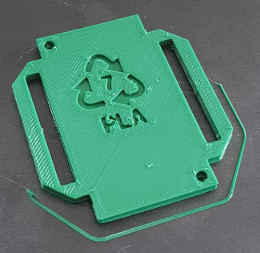

# Recycling

Resources for recycling 3D printing materials, particularly PLA.

Most recycling streams are not set up to process PLA, despite the fact that PLA is probably the most widely-used 3D printed material and is easy to recycle in a number of ways.  This needs to change, and the 3D printing industry should lobby for such a change.

The resin recycling code (see https://en.wikipedia.org/wiki/Resin_identification_code) for materials like PLA is 7 with the word "OTHER" under the recycling triangle symbol.  The files here are 3D designs for such a symbol with "PLA" under the triangle.  They are intended to be included in 3D printed designs (all of them...) that are to be printed using PLA.

Scale the shape appropriately, then position it so that it cuts one or two millimetres into a surface of the printed object in a face where such an indentation won't matter.  If you put it in the base of an object most RepRap and other 3D printers will print the indentation well without support.

The master file is a freeCAD (https://www.freecadweb.org/) design for the shape: PLA-recycling-symbol.fcstd

To scale a shape in FreeCAD select the Draft Workbench, select the shape, and from the Draft tools select Clone.  This will copy the shape and give extra X, Y, and Z scaling parameters for the result which will allow you to make it any size you like.

The design is also available as a STEP file, PLA-recycling-symbol.step, for other CAD systems, and as an STL file.

